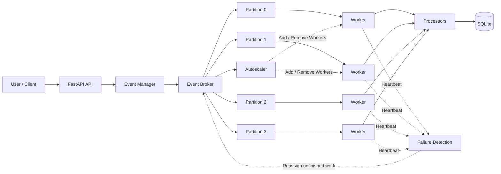
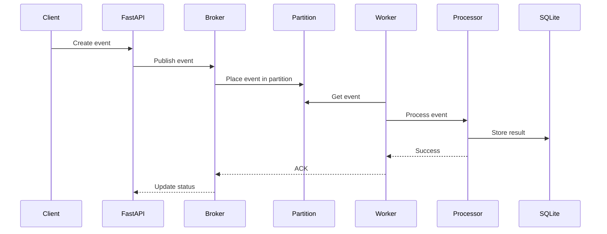
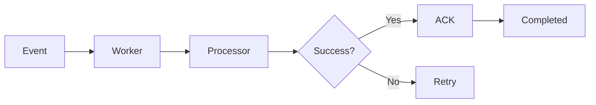
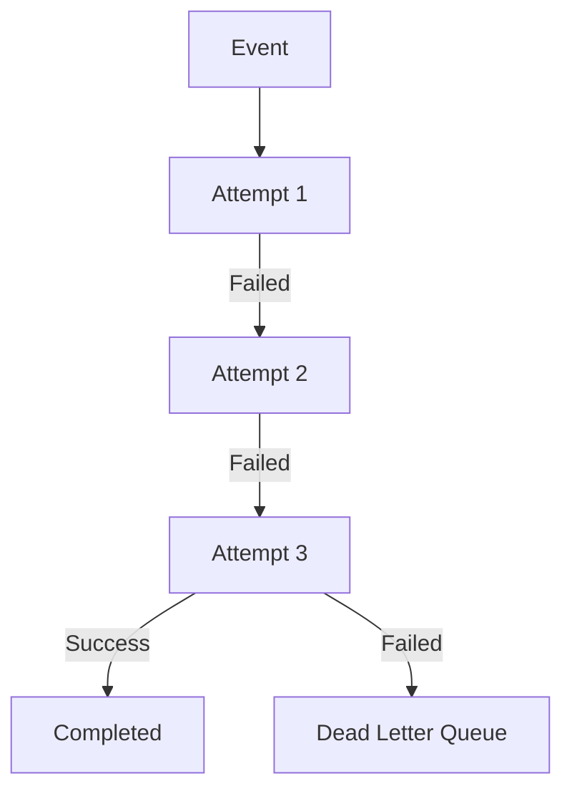
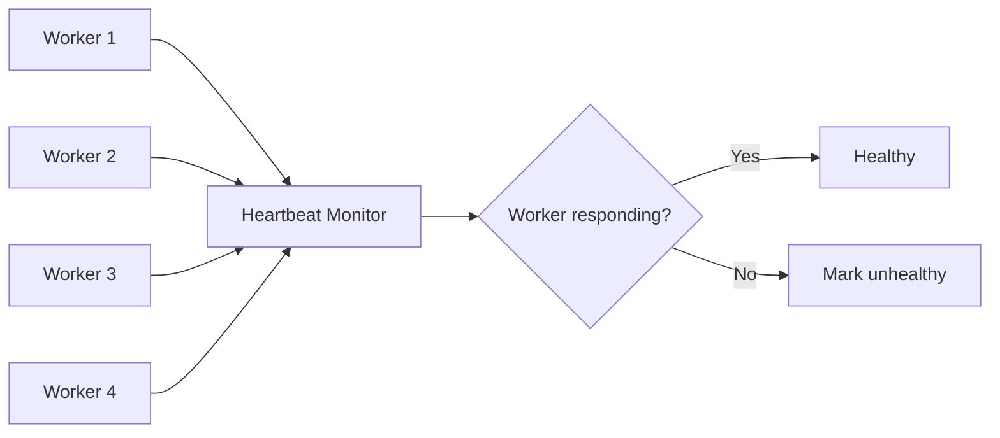
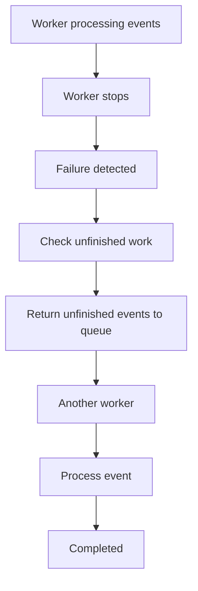
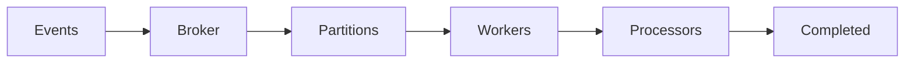
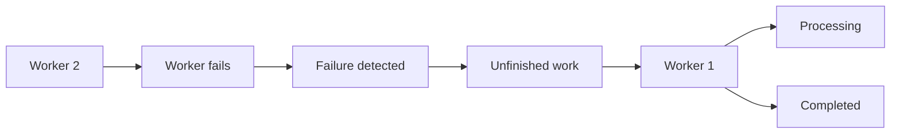
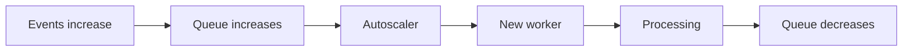

# Distributed Event Processing System

[Live Demo: Eventra](eventra-2.onrender.com)

> A student-built event processing system for learning how events can be queued, partitioned, processed concurrently, retried, and recovered when workers fail.

**Core flow**

```text
Event
  ↓
FastAPI
  ↓
Event Broker
  ↓
Partitions
  ↓
Workers
  ↓
Processors
  ↓
Result / SQLite
```

---

## 📌 Overview

The project models a small event-processing system where multiple workers can process events concurrently.

Instead of using a ready-made message broker such as Kafka or RabbitMQ, the project implements a simple in-memory broker and partition system. This keeps the project understandable while still demonstrating useful backend and distributed-systems concepts.

The system currently supports:

- Event creation through REST API and UI
- Order, Login, and Payment events
- Event partitioning
- Multiple concurrent workers
- Event-specific processors
- Acknowledgements
- Retries and a Dead Letter Queue (DLQ)
- Duplicate-event protection
- Worker heartbeats
- Basic worker failure detection and recovery
- Rule-based autoscaling
- Metrics and monitoring
- SQLite persistence
- React dashboard
- Automated tests
- Basic performance benchmarks

---

## 🏗️ System Architecture



### What happens to an event?

1. A client creates an event.
2. FastAPI receives the request.
3. The event manager sends it to the broker.
4. The broker places it into one of four partitions.
5. A worker takes an event from its assigned work.
6. The appropriate processor handles the event.
7. The result is stored in SQLite.
8. The event is acknowledged after successful processing.

---

## 🔀 Event Processing Flow



---

## 🧩 Main Components

| Component | Responsibility |
|---|---|
| **FastAPI** | Receives API requests and exposes system endpoints |
| **Event Manager** | Coordinates event submission |
| **Event Broker** | Accepts events and manages the in-memory queues |
| **Partitions** | Divide events into separate queues |
| **Workers** | Process events concurrently |
| **Processors** | Apply event-specific processing logic |
| **Failure Detection** | Detects workers that stop sending heartbeats |
| **Autoscaler** | Adds or removes workers using simple rules |
| **Metrics** | Tracks basic system activity |
| **SQLite** | Stores persistent event, worker, result, DLQ, and scaling data |
| **React UI** | Provides a simple dashboard for observing the system |

---

## 📨 Event Model

An event contains the information needed for processing.

Example:

```json
{
  "event_type": "order",
  "partition_key": "customer_101",
  "priority": 1,
  "payload": {
    "product": "Laptop",
    "quantity": 1
  }
}
```

Important fields include:

```text
event_id
event_type
partition_key
timestamp
priority
payload
status
retry_count
```

### Supported event types

| Event | Processor |
|---|---|
| Order | `OrderProcessor` |
| Login | `LoginProcessor` |
| Payment | `PaymentProcessor` |

The processor layer keeps event-specific logic separate from the worker itself and demonstrates basic OOP concepts such as abstraction and polymorphism.

---

## 🗂️ Partitioning

The system currently uses **4 partitions**:

```text
                 Event
                   │
                   ▼
             Partitioning
                   │
       ┌───────────┼───────────┐
       ▼           ▼           ▼           ▼
   Partition 0  Partition 1  Partition 2  Partition 3
```

A partition is selected from the event's `partition_key` using a simple hash-based approach:

```text
partition = hash(partition_key) % number_of_partitions
```

This allows events to be distributed between partitions while events using the same key are directed to the same partition during a run.

The partitions provide a simple way to divide work between workers.

---

## 👷 Workers

Workers perform the actual event processing.

A worker generally:

1. Gets an event.
2. Processes the event.
3. Records the result.
4. Sends an acknowledgement after success.
5. Reports a failure when processing fails.

### Worker states

```text
IDLE
BUSY
UNHEALTHY
STOPPED
```

Basic worker information includes:

- Worker ID
- Status
- Processed events
- Failed events
- Current load
- Last heartbeat

Multiple workers can operate concurrently, allowing the project to demonstrate basic producer-consumer behaviour.

---

## ✅ Acknowledgement

An event is acknowledged only after successful processing.



If a worker stops before acknowledging an event, the unfinished event can be returned to the queue and processed again.

The project therefore does **not** claim exactly-once processing.

---

## 🔁 Retry Handling

Processing can fail because of an error in the event processor.

Instead of immediately giving up, the system retries the event.



The system records the retry count and failure reason. A small delay is used between retry attempts.

If the event continues to fail after the allowed attempts, it is moved to the DLQ.

---

## ☠️ Dead Letter Queue

The **Dead Letter Queue (DLQ)** contains events that could not be processed successfully after the allowed number of retries.

A DLQ record contains information such as:

- Event ID
- Event type
- Retry count
- Failure reason
- Timestamp

This makes it possible to inspect failed events instead of silently losing them.

```text
Event
  │
  ▼
Processing
  │
  ├── Success ─────────────► Completed
  │
  └── Failure
        │
        ▼
      Retry
        │
        ├── Success ───────► Completed
        │
        └── Too many failures
                    │
                    ▼
                   DLQ
```

---

## ♻️ Duplicate Events

The system keeps track of completed event IDs.

If an event with an already-completed ID is received again, the system can identify it as a duplicate and avoid processing it again.

This provides basic duplicate protection.

> **Note:** This is duplicate protection, not a guarantee of exactly-once distributed processing.

---

## 💓 Worker Heartbeats

Workers periodically send heartbeats to show that they are still running.



The latest heartbeat is stored for each worker.

If a worker stops sending heartbeats for the configured timeout, it can be marked unhealthy.

---

## 💥 Worker Failure & Recovery

The project includes a way to simulate worker failure.



This allows the failure-recovery behaviour to be demonstrated without requiring multiple physical machines.

---

## 📈 Basic Autoscaling

The autoscaler is intentionally simple and rule-based.

It mainly looks at:

- Queue size
- Worker load
- Minimum worker count
- Maximum worker count
- Scaling thresholds
- Cooldown period

### Scale up

```text
Queue grows
    │
    ▼
Threshold reached
    │
    ▼
Autoscaler
    │
    ▼
Add worker
```

### Scale down

```text
Queue becomes small
    │
    ▼
Workers remain idle
    │
    ▼
Autoscaler
    │
    ▼
Remove worker
```

The cooldown period helps prevent workers from being added and removed too quickly.

This project uses **rule-based autoscaling**, not machine learning.

---

## 📊 Metrics

The system tracks basic metrics such as:

| Metric | Description |
|---|---|
| Total Events | Number of events received |
| Processed Events | Successfully completed events |
| Failed Events | Events that failed |
| Retry Count | Number of retry attempts |
| DLQ Count | Events currently in the DLQ |
| Queue Size | Events waiting for processing |
| Number of Workers | Current worker count |
| Throughput | Events processed per unit of time |
| Average Processing Time | Average event processing duration |
| Worker Load | Current worker activity |

These metrics are used by the dashboard to show the current state of the system.

---

## 🗄️ Database

The project uses **SQLite** for persistent information.

Main tables:

```text
events
workers
processing_results
dead_letter_events
scaling_events
```

The active event queues are handled by the broker, while important system information is stored in SQLite.

---

## 🌐 REST API

The backend is built with **FastAPI**.

| Method | Endpoint | Purpose |
|---|---|---|
| `POST` | `/events` | Create an event |
| `POST` | `/events/batch` | Create a batch of events |
| `GET` | `/events` | View events |
| `GET` | `/events/{event_id}` | View one event |
| `GET` | `/workers` | View workers |
| `POST` | `/workers` | Create a worker |
| `DELETE` | `/workers/{id}` | Remove a worker |
| `POST` | `/workers/{id}/crash` | Simulate worker failure |
| `GET` | `/partitions` | View partitions |
| `GET` | `/metrics` | View system metrics |
| `GET` | `/dead-letter-events` | View DLQ events |
| `POST` | `/dead-letter-events/{id}/redrive` | Redrive a DLQ event |
| `GET` | `/scaling-events` | View scaling history |
| `GET` | `/health` | Check system health |

FastAPI's built-in API documentation can be used to test the endpoints.

---

## 🖥️ Frontend

The frontend is built with **React** and is intentionally kept simple so that the system behaviour is easy to understand.

### Dashboard

Shows:

- Total events
- Processed events
- Failed events
- Queue size
- Active workers
- Throughput
- Recent events
- Basic autoscaling information

### Events

Shows event information such as:

- Event ID
- Event type
- Partition
- Worker
- Status
- Retry count

Events can also be created from this page.

### Workers

Shows:

- Worker ID
- Status
- Current load
- Processed count
- Failed count
- Last heartbeat

A worker can be stopped to demonstrate failure recovery.

### Partitions

Shows the four partitions and their current queue sizes.

### Failures

Shows failed events, retries, and DLQ events.

### Benchmarks

Runs simple performance tests using different worker counts.

---

## 🧪 Example Demonstrations

The project is designed around three easy demonstrations.

### 1. Normal Processing



### 2. Worker Failure



### 3. Autoscaling



---

## 📁 Project Structure

The repository is kept modular but intentionally small.

```text
distributed-event-processing-system/
│
├── backend/
│   ├── app/
│   │   ├── main.py
│   │   ├── models.py
│   │   ├── broker.py
│   │   ├── worker.py
│   │   ├── processor.py
│   │   ├── scheduler.py
│   │   ├── autoscaler.py
│   │   ├── metrics.py
│   │   ├── database.py
│   │   └── api.py
│   │
│   ├── tests/
│   │   ├── test_broker.py
│   │   ├── test_worker.py
│   │   ├── test_processor.py
│   │   ├── test_retry.py
│   │   └── test_autoscaler.py
│   │
│   └── benchmarks/
│
├── frontend/
│   └── src/
│       └── pages/
│           ├── Dashboard/
│           ├── Events/
│           ├── Workers/
│           ├── Partitions/
│           ├── Failures/
│           └── Benchmarks/
│
├── scripts/
│
├── .gitignore
├── README.md
└── requirements.txt
```

> The exact file structure can change as the project develops. The important goal is to keep the broker, workers, processors, autoscaler, metrics, and API logic separate.

---

## ⚙️ How to Run

### Backend

Install Python dependencies:

```bash
pip install -r requirements.txt
```

Start the backend:

```bash
uvicorn backend.app.main:app --reload
```

The API will be available on the local address shown by Uvicorn.

FastAPI documentation is available at:

```text
/docs
```

### Frontend

```bash
cd frontend
npm install
npm run dev
```

Open the local address shown by Vite.

---

## 🧪 Running Tests

Run:

```bash
pytest
```

Tests cover important parts of the system, including:

- Event creation
- Partitioning
- Broker behaviour
- Worker processing
- Acknowledgements
- Retry handling
- DLQ
- Duplicate events
- Worker failure
- Autoscaling

Test results should be reported from the current implementation rather than hard-coded in this README.

---

## 🏎️ Running Benchmarks

The benchmark can be used to compare different worker counts.

Example:

```text
1000 events

1 worker
2 workers
4 workers
```

The benchmark records:

- Processing time
- Throughput
- Average latency

Example result format:

```text
Workers    Events    Time (s)    Throughput
------------------------------------------------
1          1000      ...
2          1000      ...
4          1000      ...
```

Benchmark values should always come from an actual run of the current implementation.

---

## 🧠 What I Learned From This Project

This project was mainly built to understand the practical side of backend and distributed-system concepts.

It demonstrates:

- Producer-consumer systems
- Queues
- Event partitioning
- Concurrent workers
- OOP and polymorphism
- REST APIs
- Database persistence
- Acknowledgements
- Retry handling
- Dead Letter Queues
- Duplicate-event handling
- Worker heartbeats
- Failure recovery
- Rule-based autoscaling
- Monitoring
- Performance benchmarking
- Automated testing

The main question behind the project was:

> **How can a system divide work between multiple workers, and what should happen when some of that work or a worker fails?**

---

## ⚠️ Current Limitations

This is a learning project and is intentionally kept small.

Current limitations include:

- Runs on a single machine
- Workers are concurrent workers rather than separate physical servers
- Active queues are handled in memory
- Number of partitions is fixed
- Autoscaling is rule-based
- It does not replace production message brokers such as Kafka or RabbitMQ
- It is not designed for production-scale workloads

These limitations keep the implementation manageable while making the main concepts easier to study.

---

## 🚀 Possible Future Improvements

Some possible extensions are:

- Run workers on separate machines
- Add a persistent message queue
- Improve partition management
- Add more scheduling strategies
- Add more detailed monitoring
- Deploy the system on AWS
- Test with larger workloads

---

## 📌 Project Status

**Status:** Active student project

The core system focuses on event ingestion, partitioning, concurrent processing, retries, failure recovery, monitoring, and basic autoscaling.

The project will continue to evolve as additional experiments and improvements are added.

---

## 📄 License

This project is intended for educational and portfolio purposes.
